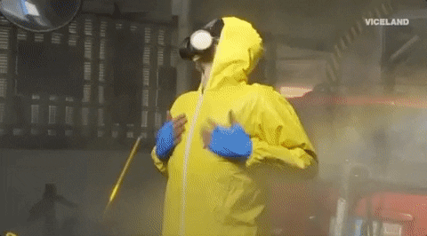

# API-scrapping

#
## **OVERVIEW**
#
### In this project we are going to enrichen a dataset by using APIs and web scrapping.

### The objective is to perform a pipeline which contains all the code and the function calling
#
## **DATASET**
#
### https://www.kaggle.com/imdevskp/corona-virus-report?select=covid_19_clean_complete.csv
#
## **API**
#
### https://rapidapi.com/api-sports/api/covid-193/

#
## **LIBRARIES**
#

### Pandas
### Numpy
### Seaborn
### Matplotlib
### Re
### Plotly.express
### plotly.graph_object
### requests